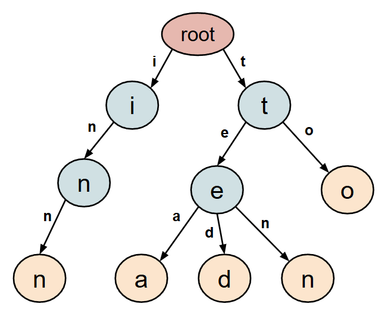

# Testing document

## How to run the tests & coverage

```bash
# 1) Install dev deps (pytest, pytest-cov, etc.)
poetry install --with dev

# 2) Run the fast suite (excludes slow end-to-end test)
poetry run pytest -q -m "not slow"

# 3) Run everything (including the slow end-to-end test)
poetry run pytest -q

# 4) Coverage in terminal (and show missing lines)
poetry run pytest --cov=namegen --cov-report=term-missing -m "not slow"

# 5) Run just the end-to-end test
poetry run pytest -q tests/test_e2e.py -m slow
```
## Unit Testing Coverage Report

| File                       | Stmts | Miss | Cover  | Missing                         |
|----------------------------|-------|------|--------|---------------------------------|
| src\namegen\__init__.py    | 3     | 0    | 100%   | —                               |
| src\namegen\generator.py   | 73    | 7    | 90%    | 32, 81, 111, 115, 118, 124, 144 |
| src\namegen\trie.py        | 64    | 1    | 98%    | 98                              |
| **TOTAL**                  | 140   | 8    | **94%**|                                 |

**Notes on uncovered lines**  
    The uncovered lines are primarily defensive/fallback branches (e.g., early exits on empty counts) that are not exercised by normal inputs.

## What was tested and how
### Weighted sampling (sample_weighted) 

- Empty / all-zero maps return None
  - How: { }, {"a":0,"b":0} with a seeded RNG returns None.

- Single positive key dominates
    - How: repeat 10 draws with {"x":3,"y":0} and Random(0); always returns "x".

- CDF boundaries are respected
    - How: with weights {"a":1,"b":3,"c":6} and a fake RNG sequence [0.05, 0.25, 0.75], the picks are "a", "b", "c" in order.

- Default RNG works
    - How: no RNG passed; result is in {"a","b"} for {"a":1,"b":1}.

### Trie construction & queries
- Validation guards
    - order=0 → ValueError
    - fit([]) → ValueError
    - order longer than longest name → ValueError.
- Case normalization
    - default casefold() merges “Anna/anna”
    - with normalize_case=False both branches exist.

- Successors & start contexts
    - small sets like ["anna","anne"] and ["maria","marie","mark"] verify successors() and start_counts.

- Order=1 stores counts on root
    - for ["abc","aba"], successors("") == {"a":3,"b":2,"c":1}.

- Shape & counts match the classic example
    - for ["to","tea","ted","ten","i","in","inn"], assert the exact prefix shape and the bigram/trigram statistics shown in class (e.g., start_counts for order 2: {"t":4,"i":3}, for order 3: {"to":1,"te":3,"in":2}).
    - ASCII printer outputs the trie; test asserts expected lines are present.
``` 
# printed trie from ["to","tea","ted","ten","i","in","inn"]

(root)
+- i
|  +- n
|     +- n
+- t
   +- e
   |  +- a
   |  +- d
   |  +- n
   +- o
``` 


### Name generation (NGramGenerator) 

- Exact length honored (when feasible)
    - with mixed names and target_len=4, output (if not None) has length 4.

- Order=1 path
    - generation uses root counts
    - generating length-2 names returns exactly 2 chars.

- Argument validation
    -  target_len>max_len raises ValueError
    - Additional guards: invalid min_len (0, >max_len, >target_len) all raise.

- Graceful stop when no successors
    - using tiny corpus like ["zx"] and generate_once(..., stop_prob=0.0) yields "" or very short.

- Variable-length stopping behavior
    - fake RNG sequences bound the produced length for order-3 models.

- Reject exact training names
    - with names ["maria"], force reconstruction and set retries=0, result is None.

- Early stop on training name (variable mode)
    - ["an"] and stop_prob=1.0  returns "an" immediately.

- Closed-corpus n-gram integrity
    - for ["abababababababa"] (order 2), every generated bigram is in the observed set.

### End-to-end batch quality & reproducibility 
- Tests: test_end_to_end_batch_quality_and_reproducibility
- Intent: Exercise the full pipeline (load real dataset → build NGramTrie → generate a batch) and verify core quality properties and reproducibility under a fixed RNG seed.

- How:
    - Load a real dataset from data/ (falls back to a small built-in list if missing).
    - Build an order-3 model, then generate a batch of ~200 names (min_len=3, max_len=12, stop_prob≈0.35, retries=500, capitalize=False).
    - Assert: (a) ≥80% non-empty, (b) lengths within bounds, (c) character set ⊆ training chars, (d) n-gram integrity—every generated trigram appeared in training, (e) novelty and diversity ≥ 0.5 when the dataset is large enough.
    -  Reproducibility: same seed produces an identical sequence; a different seed produces a different sequence.